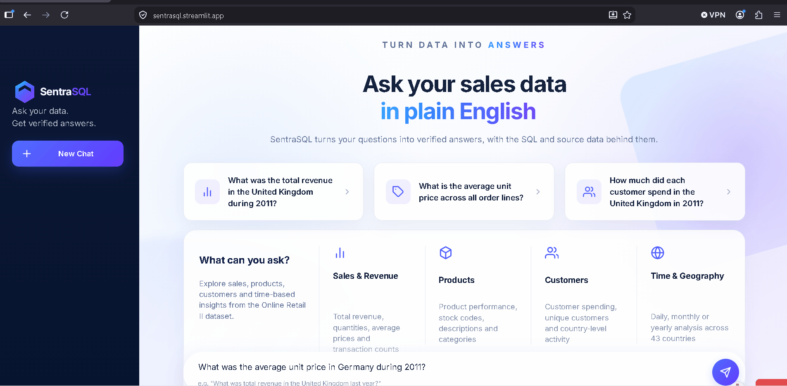

# SentraSQL

**Ask your sales data in plain English — get verified answers, with the reasoning shown.**

SentraSQL is a natural-language analytics agent. You type a question about a real e-commerce dataset, and it turns that question into a validated SQL query, runs it against the real database, and answers you in plain language — with every assumption, exclusion, and adjustment it made along the way stated explicitly, never hidden.

**🔗 Live demo:** [sentrasql.streamlit.app](https://sentrasql.streamlit.app) — no setup required, just click and ask a question.



---

## Why this project is interesting

Most "AI talks to your database" demos let a language model write and run SQL directly — which means the model can just as easily hallucinate a wrong number as a right one, and you'd have no way to tell the difference.

SentraSQL is built around a different principle: **the AI never touches the database, and it never invents a number.**

- **The AI never writes SQL.** Every query is built by deterministic code from a structured, validated understanding of your question — not generated as free text by the model.
- **A dedicated security layer checks every query before it runs** — full SQL-parse-tree inspection (not just text pattern matching), a strict table/column/function whitelist, and a genuinely read-only database connection underneath it all, as a second, independent safety layer.
- **The AI can't fabricate a number in its answer, even if it wanted to.** Instead of generating free-form prose, it can only reference values that were already computed and verified — a mechanical check rejects any response that contains a number typed directly into the answer text rather than pulled from a real, computed source.
- **Every assumption and exclusion is disclosed, not hidden.** If a "last month" reference had to be resolved to specific dates, if zero-price rows were excluded from an average, if a guest checkout was left out of a customer breakdown — the answer says so, every time, automatically.
- **If a question can't be answered reliably, it says so — it doesn't guess.** A reference to a country that doesn't exist, or a question that genuinely matches zero data, gets a clear, honest response instead of a misleading one.

---

## What you can ask it

The dataset behind SentraSQL is a real UK e-commerce transaction log (~1.07 million rows, December 2009 – December 2011, 43 countries). You can ask about revenue, average prices, customer spending, product performance, returns and cancellations, and specific time periods — individually or combined in one question.

Example questions:
- *"What was the total revenue in the United Kingdom during 2011?"*
- *"What is the average unit price paid by each customer in the United Kingdom in 2011, excluding cancelled invoices?"*
- *"How many distinct customers made purchases in 2011?"*

---

## Tech stack

- **Orchestration:** LangGraph (an 8-node state graph) + LangChain
- **Language model:** DeepSeek (structured/function-calling mode)
- **Data layer:** SQLite, `pandas` for preprocessing, `sqlglot` for SQL construction and validation
- **Dataset:** [UCI Online Retail II](https://archive.ics.uci.edu/dataset/502/online+retail+ii)
- **Interface:** Streamlit
- **Testing:** 250+ automated unit/integration tests, plus a live evaluation suite that independently re-verifies real answers against hand-written reference SQL queries

---

## Running it locally

```bash
git clone https://github.com/mohamedchashem/sentrasql.git
cd sentrasql
uv venv --python 3.12
uv pip install -r requirements.txt
```

Create a `.env` file in the project root with your own DeepSeek API key:

```
DEEPSEEK_API_KEY=your-key-here
```

Then run the dashboard:

```bash
streamlit run dashboard/app.py
```

---

## Known limitations

Being upfront about current scope rather than overstating it:
- No comparisons between two time periods in a single question (e.g. "this month vs. last month").
- No data outside the December 2009 – December 2011 range.
- No report/PDF export.
- Vague or ambiguous product references (e.g. "the mug," where multiple products could match) are not guaranteed to resolve correctly — a deliberate, documented scope decision, not an oversight.
